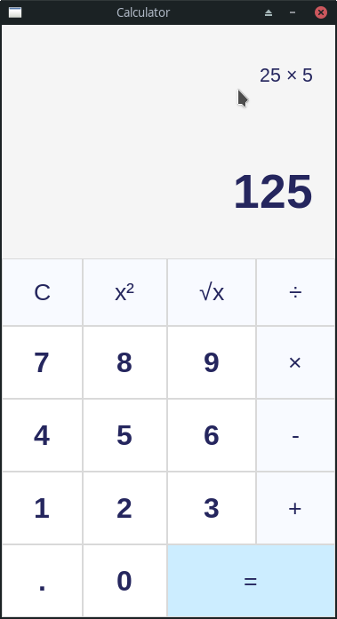

# Tkinter Calculator (Python)



## Run the python calculator

```bash
$ python app.py
```

## Install requirements

> The Tkinter library is built-in with every Python installation.

Read more: https://tkdocs.com/tutorial/install.html

## Standalone Executable

At first you need to install the **pyinstaller**: `$ pip install pyinstaller`

Next:
```bash
$ pyinstaller --onefile -w calc.py
```

I get the idea from a [video](https://www.youtube.com/watch?v=QZPv1y2znZo).
